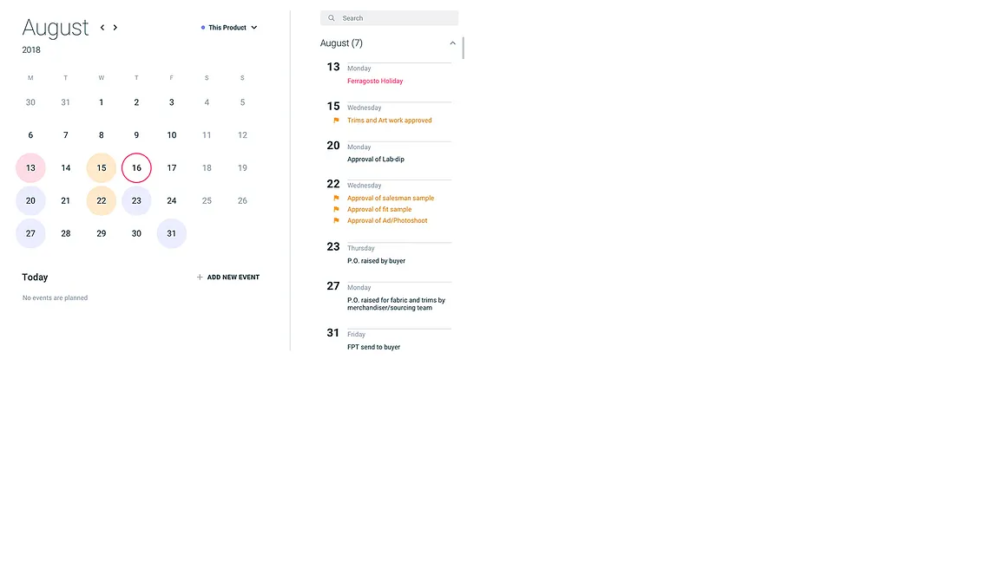

# Lofam

A lightweight, self-hosted task management application with calendar view.



## Features

- Calendar view with tasks organized by date
- Task management with status, priority, and due dates
- Search and filter tasks
- Self-hosted with SQLite storage (no external dependencies)
- RESTful API

## Quick Start

### Using Docker Compose (Recommended)

```bash
docker compose up
```

- **Frontend**: http://localhost:3000
- **Backend API**: http://localhost:8080

### Auto-Rebuild on Changes

```bash
docker compose watch
```

Automatically rebuilds containers when source files change.

### Local Development

**Backend:**
```bash
cd backend
go run ./cmd/server
```

**Frontend:**
```bash
cd frontend
bun install
bun dev
```

## API Reference

### Endpoints

| Method | Endpoint | Description |
|--------|----------|-------------|
| GET | `/api/tasks` | List all tasks |
| POST | `/api/tasks` | Create a new task |
| GET | `/api/tasks/{id}` | Get task by ID |
| PUT | `/api/tasks/{id}` | Update task |
| DELETE | `/api/tasks/{id}` | Delete task |

### Task Schema

```json
{
  "id": 1,
  "title": "Task title",
  "description": "Optional description",
  "status": "todo",
  "priority": "medium",
  "dueDate": "2025-12-25T00:00:00Z",
  "createdAt": "2025-12-27T10:00:00Z"
}
```

**Status values:** `todo`, `in_progress`, `done`

**Priority values:** `low`, `medium`, `high`

## Project Structure

```
lofam/
├── backend/                 # Go API server
│   ├── cmd/server/          # Entry point
│   ├── internal/
│   │   ├── http/            # HTTP handlers & middleware
│   │   ├── sqlite/          # Database layer
│   │   └── task/            # Domain logic
│   └── Dockerfile
├── frontend/                # Next.js application
│   ├── app/                 # App router pages
│   ├── components/          # React components
│   ├── lib/                 # API client & utilities
│   └── Dockerfile
├── infrastructure/aws/      # AWS provisioning scripts
├── .github/workflows/       # CI/CD pipelines
├── docker-compose.yml       # Development
└── docker-compose.prod.yml  # Production (with HTTPS)
```

## Configuration

### Environment Variables

| Variable | Service | Default | Description |
|----------|---------|---------|-------------|
| `PORT` | Backend | `8080` | HTTP server port |
| `DB_PATH` | Backend | `lofam.db` | SQLite database path |
| `NEXT_PUBLIC_API_URL` | Frontend | `http://localhost:8080` | Backend API URL |

## Tech Stack

**Backend:**
- Go 1.21+
- Chi router
- SQLite (modernc.org/sqlite - pure Go, no CGO)

**Frontend:**
- Next.js 16
- React 19
- Tailwind CSS 4

## Testing

### Backend (Go)

```bash
cd backend
go test ./...
```

### Frontend (Playwright E2E)

**Setup (once):**
```bash
cd frontend
bun install
bun run test:e2e:install           # install browser
sudo bunx playwright install-deps  # install system dependencies
```

**Run tests:**
```bash
bun run test:e2e      # headless
bun run test:e2e:ui   # with UI
```

Tests automatically start backend and frontend servers.

## Deployment

See [DEPLOYMENT.md](DEPLOYMENT.md) for AWS EC2 deployment with GitHub Actions CI/CD.

## License

MIT
